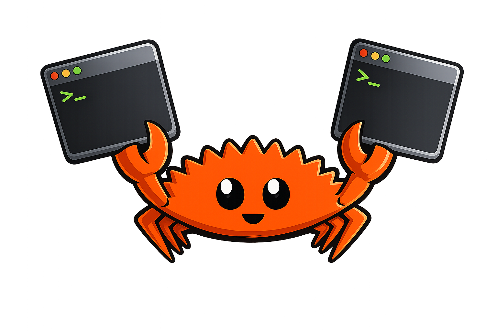

<p align="center">
  
</p>

# <p align="center"> RDWM </p>

RDWM is a small, minimalist tiling window manager written in Rust using XCB.

## Features
- **Tiling layout:** Minimal dynamic horizontal tiling that divides the screen evenly across visible windows, with per-client "weight" sizes.
- **Workspaces:** Multiple workspaces (default: 10, configurable via `NUM_WORKSPACES`).
- **Keyboard-first controls:** Full keyboard-driven workflow (spawn apps, close clients, focus next/previous, swap windows, switch/send to workspaces).
- **Window sizing controls:** Adjust per-window size weights and global window gaps via keybindings (no mouse resizing).
- **EWMH / ICCCM:** Publishes _NET_SUPPORTED/_NET_SUPPORTING_WM_CHECK, _NET_NUMBER_OF_DESKTOPS, _NET_CURRENT_DESKTOP and exposes window desktop hints for external bars/panels.
- **Dock handling:** Detects `_NET_WM_WINDOW_TYPE_DOCK` windows and reserves a dock area (configurable dock height in code).
- **Graceful close + fallback:** Sends `WM_DELETE_WINDOW` when supported, falls back to `KillClient` if necessary.
- **Autostart support:** Runs `~/.config/rdwm/autostart.sh` on startup.
- **Hot Reloading** Enabled fast development iterations 
- **Lightweight implementation:** Built on `xcb` and `xkbcommon`, small dependency surface.
- **Logging:** Uses `log` + `env_logger` (run with `RUST_LOG=debug` for verbose output).

## Building
1. Install Rust toolchain (stable) and necessary X development libraries for `xcb` and `xkbcommon`.
2. Build in debug mode:

```bash
cargo build
```

3. Build a release binary:

```bash
cargo build --release
```

Running (preview)
- The repository includes `preview.sh` which builds and then uses `xinit` with `Xephyr` to run `rdwm` in a nested X server for testing.
- Example:

```bash
./preview.sh
```

Notes
- Configure key bindings and behavior in [src/config.rs](src/config.rs) and [src/key_mapping.rs](src/key_mapping.rs).
- Logging uses the `log` and `env_logger` crates; run with `RUST_LOG=debug` to see debug output.
- Recommended testing: use `./preview.sh` (starts rdwm under `Xephyr`) before using as your main WM.

## TODO

- [x] Horizontal tiling with even spacing across visible windows
- [x] Multiple workspaces (configurable via `NUM_WORKSPACES`)
- [x] Keyboard-driven controls: spawn apps, kill focused client, focus next/previous, switch workspaces
- [x] Lightweight, minimal dependencies (`xcb`, `xkbcommon`) and simple configuration in [src/config.rs](src/config.rs)
- [x] Basic logging via `log` + `env_logger`
- [x] Move windows around within a workspace (swap)
- [x] Adjust window size weights and global gaps via keybindings
- [x] Move windows between workspaces
- [x] Add EWMH (NETWM) / ICCCM hints for compatibility with panels/status bars
- [x] Dock window detection and reservation of dock area
- [x] Graceful WM_DELETE handling with fallback kill
- [x] Autostart support (`~/.config/rdwm/autostart.sh`)
- [ ] Create a custom status bar (or integration points) so you can build your own bar displaying workspaces, layout, and window titles
- [ ] Additional layouts (stacking, master-stack, dynamic layouts)
- [ ] Improved multi-monitor support and per-monitor workspaces
- [ ] Mouse-driven interactive resize/drag
- [ ] More robust error handling and configuration parsing
